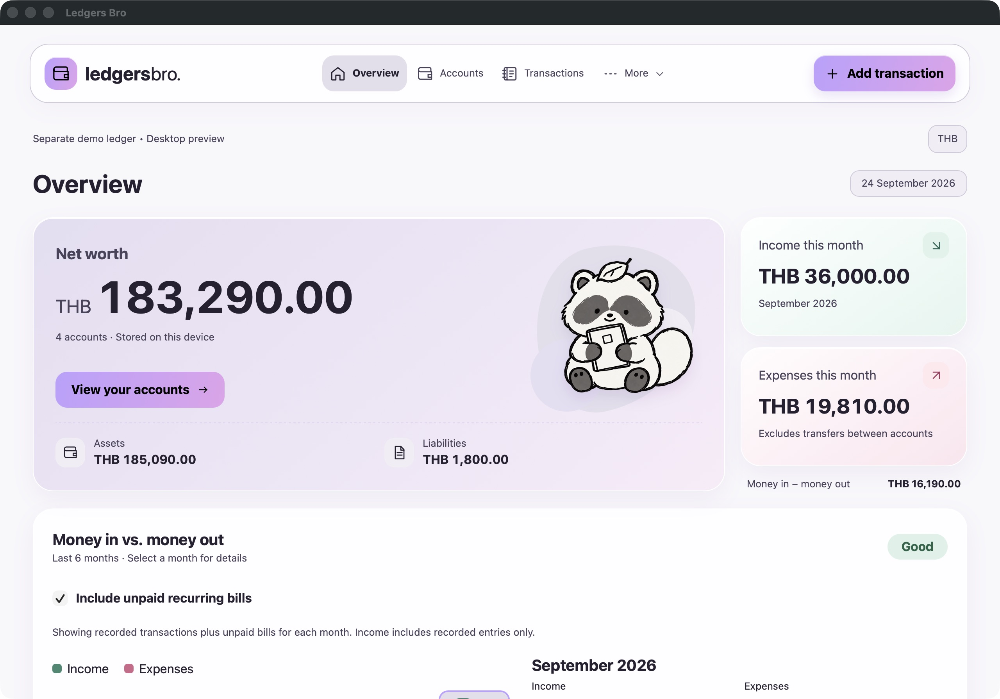
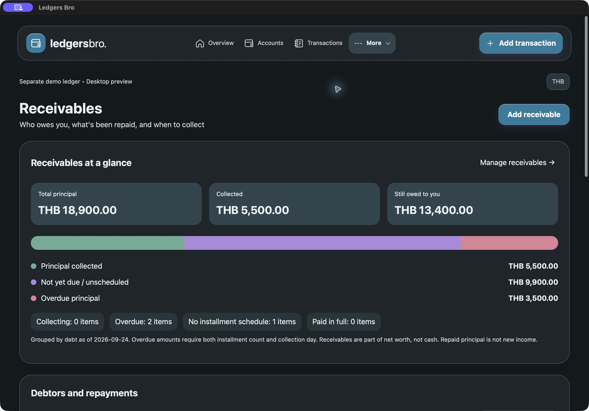
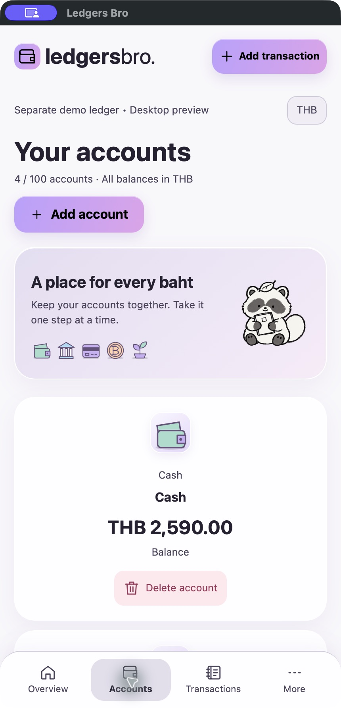

# Ledgers Bro 🦝💸

Your money ghosted you. Let's find it.

An open-source, local-first ledger built with **Rust + Dioxus + SQLite**. Thai / English UI, light / dark themes. Your wallet, your device, your business.

## Download & install 📦

**Coming soon. No installer release yet.** When published, grab an installer from [GitHub Releases](https://github.com/Rayato159/ledgers-bro/releases). No Rust, no build tools, no terminal side quest.

- **Windows:** download the `.msi`, double-click it, and follow the installer.
- **Android:** download the `.apk` on your phone, open it, and allow installation from that source if Android asks.
- **macOS / Linux / iOS:** no ready-to-install packages announced yet.

Release files will appear when a release is ready. The source code below is for building it yourself. 🛠️

## The receipts 📸

Real app captures with synthetic data. The mobile image shows the responsive layout in a narrow desktop window, not an iOS build.



<table>
  <tr>
    <td width="72%"></td>
    <td width="28%"></td>
  </tr>
</table>

## Build & try it 🧑‍💻

Clone the repository and install **Rust 1.88+**. Run commands from the repository root unless stated otherwise.

### Desktop — macOS, Windows, Linux

Install your platform's [Dioxus native prerequisites](https://dioxuslabs.com/learn/0.7/getting_started/), plus CMake and libclang:

| Platform | Native tools |
| --- | --- |
| macOS | Xcode Command Line Tools, CMake, LLVM |
| Windows | MSVC C++ Build Tools, CMake, LLVM, WebView2 |
| Linux | C/C++ toolchain, CMake, Clang, WebKitGTK 4.1 and the Dioxus system libraries |

```sh
cargo run -p ledgers-bro --locked -- --data-dir .data/sandbox
```

That builds and opens the app with a separate test ledger. Add `--mobile-preview` after `--data-dir .data/sandbox` to check the phone-width layout on desktop. For an optimized build:

```sh
cargo build -p ledgers-bro --release --locked
```

Run `target/release/ledgers-bro` (`ledgers-bro.exe` on Windows). Optional receipt scanning needs the [OCR runtime setup](docs/receipt-ocr.md).

### Android — device or emulator (experimental)

1. Install Python 3.10+, JDK 21, and Android Studio. In SDK Manager, install SDK platform tools, NDK, and CMake. Set `JAVA_HOME` and `ANDROID_HOME` to their installation folders.
2. Install the Rust target and pinned Dioxus CLI, then build:

```sh
cargo install dioxus-cli --version 0.7.2 --locked
rustup target add aarch64-linux-android
python3 scripts/build-android.py --check
python3 scripts/build-android.py
```

3. Connect a phone with USB debugging enabled, accept its debugging prompt, and install the test APK:

```sh
adb devices
adb install -r target/android/ledgers-bro-test-arm64.apk
```

4. Open **Ledgers Bro** on the device. This APK uses a debug signature.

Use `python` if that is your Python executable's name. For an x86_64 emulator, install the `x86_64-linux-android` Rust target, build with `--target x86_64-linux-android`, and install `target/android/ledgers-bro-test-x86_64.apk`. [Full Android guide](docs/android-emulator-th.md).

### iOS

No iOS host or working build steps yet, so there is no IPA to run on an iPhone. The “soon™” era continues. 🫠

### Tests

```sh
cargo fmt --all -- --check
cargo clippy --workspace --all-targets --locked -- -D warnings
cargo test --workspace --locked
```

## Tiny but relevant 🧾

In **More → Settings**, choose a currency before creating the first account. Each ledger uses one currency; no automatic conversion. Supported: THB, USD, EUR, GBP, AUD, CAD, SGD, CNY. Desktop can use separate `--data-dir` folders for separate ledgers. Thai tax is optional and THB-only. Prompts and speech currently use Thai; receipt OCR supports THB receipts.

[MIT](LICENSE). Fork it, fix it, make your wallet less embarrassing. Third-party [models / OCR](licenses/) and [fonts](crates/ui/assets/fonts/LICENSE.txt) retain their own licenses. Early software: try synthetic data first; the local database is not encrypted.
