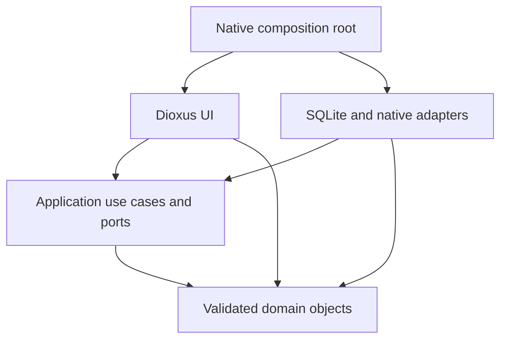

# Architecture

Ledgers Bro is a local-first Rust application with a shared Dioxus UI and native Windows/Android hosts. Each local user owns a single-currency ledger. SQLite remains the storage engine; there is no remote account backend or cloud ledger sync.

## Accounting and persistence

The UI calls `UiGateway`; the host wires a bounded worker and platform adapters. Ledger work owns its SQLite connection and runs outside the UI thread. Native file dialogs, OCR, model downloads, price requests, notifications and installation actions remain adapters, not domain rules.

Money uses integer minor units, bounded by 9,000,000,000,000. Supported currencies have two decimal places; currency conversion is not implemented. Floating-point chart geometry is separate from accounting amounts. Loading saved data reconstructs validated objects and checks stored postings against generated postings.

Journal factories create balanced posting pairs. Opening balances use equity, purchases on credit create liabilities, card repayments are transfers, and receivable principal is an asset movement. Only earned interest contributes income on a principal collection. Cancellation keeps the original and creates its linked reversal on the original effective date. Accounting exports include both; flow reports exclude cancelled originals.

Mutations begin an immediate SQLite transaction, reload current state and reapply application policies before writing atomically. Foreign keys stay enabled. Submission IDs plus payload comparisons distinguish retries from conflicting reuse. Prepared reviews are not writes; stale reviews require another confirmation. Account deletion reviews complete affected entries and transfer-counterparty balances, and is rejected where receivable history would be invalidated.

Recurring plans store terms separately from payments. A settlement atomically links an expense to a plan/month. Editing future terms stops the old plan and creates replacement terms without rewriting earlier periods or existing settlements. Receivable opening, lending, principal collection and interest use separate accounting meanings.

## Input boundaries

The deterministic quick-entry parser consumes the complete bounded input. Unknown names require choices, and unsupported text is not silently truncated. An optional local Qwen proposal passes schema, grounding, amount, date and entity validation; it never supplies SQL or write authority. Multi-action confirmations commit atomically with durable idempotency.

OCR adapters have no ledger authority. Temporary images are normalized, metadata is stripped and recognized candidates become editable DTOs. Exact reconciliation constructs validated receipt lines; only reviewed details persist in notes. Android Kotlin owns document selection, voice and image bridges while Rust owns financial decisions.

## Session and projections

Profiles use Argon2id passwords, per-user ledgers and optional seven-day native remembered-login tokens. This is local access control, not database encryption. Session identity guards against old-user work after switching users.

The model library is owned at the app/session root so navigation cannot discard an active download. Explicit cancellation or session closure ends it. Pinned files are size/hash checked before activation; incomplete files are not installed.

Read-only panels are deferred when inactive, transaction history is rendered in pages of 20 and users can filter by year. Settlement lookup is indexed. The full validated ledger still resides in application memory: these changes are not database pagination or a constant-memory guarantee. The [SQLite decision](turso-assessment.md) documents the storage boundary.

The host supplies a local-date clock; tests supply fixed dates. Relative dates freeze on submission. Yearly history is retained, with a backup reminder at year changes. Crypto prices are external estimates, not cash income. Tax uses an explicit [supported rule pack](tax-engine.md) and cannot infer gross income or legal eligibility from ordinary categories.

## Platform and release limits

Windows ships MSI/portable packages with native OCR. Android ships debug-signed test APKs with private storage, document selection and supported on-device voice adapters. There is no iOS package. Closed-app background notifications, encrypted databases/backups, cloud sync and a full statutory tax/accounting system are not implemented.

Current schemas are ledger version 10 and profile version 2. Backups cover one saved ledger, exclude credentials/models and restore only into an empty ledger after validation. Upgrades and restores require populated synthetic fixtures and unchanged-accounting checks. See [testing and releases](testing-and-release.md) for package and privacy gates.
