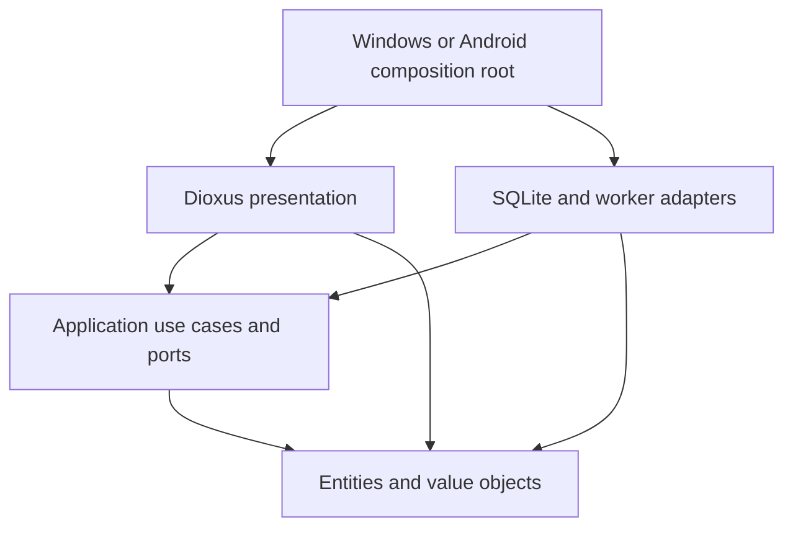

# Architecture — first executable slice

The implemented bounded context is a THB ledger with manual/command entry and reviewed receipt OCR. Annual personal-income tax worksheets are implemented with explicit supported cases. Device authentication, investment positions, and notification imports remain planned contexts/adapters.

## Dependency direction

Cargo crates enforce the direction. UI receives `UiGateway`; the host wires `LedgerWorker` and a native export dialog. The worker owns one connection and a bounded queue, returning futures. Use cases and repository tests need no window. Domain tests need no database or OS clock.

`apps/android` is a separate test host. Safe Wry JNI dispatch obtains `getNoBackupFilesDir()` and invokes Kotlin Storage Access Framework adapters. SQLite bootstrap, export and receipt recognition run off the UI thread. Kotlin owns document selection, image normalization and untrusted OCR output, never amounts or accounting. A JVM-attached worker polls receipt results with request IDs/cancellation; this avoids repeated UI dispatch across the document picker's Activity transition. The test sandbox includes tanuki assets, Thai fonts and pinned OCR language files. Android INTERNET permission supports Dioxus's authenticated loopback UI transport and explicit LLM model download, not a remote ledger backend.

## Accounting consistency

`Account` and `JournalEntry` are entities with distinct ID types. `AccountName`, `Money`, `PositiveMoney`, `EntryDate`, and `Note` are validated value objects. Account kind and initial categories are closed enums; custom editable categories should become identified catalog entities when implemented.

`ReceiptLine` and `ReceiptBreakdown` are immutable value objects. A breakdown can only be constructed when line contributions equal the payment in exact minor units. Editable OCR candidates are application DTOs, not trusted domain objects. The application validates user review and reconciliation before preparing an entry, then generates the durable bullet note from those validated values. The Windows `TesseractOcr` adapter implements the application-owned `ReceiptOcr` port and has no access to the ledger repository. Receipt images/raw OCR remain temporary; the reviewed line details persist in the journal note and CSV.

`JournalEntry` is an aggregate root whose factories create balanced pairs. Positive user-account balances are assets; negative balances are liabilities. System equity/income/expense books are the counterparty. Credit purchases reduce the card balance; bank-to-card payments raise it toward zero. Opening balances affect equity, not earned income.

SQLite mutations acquire an immediate transaction, reload current state, call shared policies, then write every row together. Count, name, and active-account checks happen under the lock. Submission IDs plus payload comparisons distinguish retries from conflicting reuse. Two separately prepared identical purchases remain distinct.

Cancellation reverses the original effective date and preserves the original, reversal relation, and UTC recorded times. Reports omit cancelled originals from income/expense but include all postings in balances. This is correction semantics; refunds need a separate use case.

Account deletion is a separate, permanent operation. `AccountDeletion` is an immutable application review plan containing the exact reviewed ledger state, entry IDs, counts, and counterparty balance previews. It removes the account, opening balance, whole income/expense/transfer aggregates, and associated reversals. A transfer is removed from both accounts; independent entries on its counterparty are retained. Both cancelled and active original transactions are included in the preview count. The plan validates resulting monetary bounds, including balances that previously depended on offsetting transfers.

`SqliteLedger::delete_account` acquires an immediate transaction and compares current state to the reviewed snapshot before deleting any rows. Any intervening ledger mutation requires a fresh review. Postings and journal entries are removed in reverse recording order, then the account; foreign keys stay enabled throughout. Failure rolls back the entire operation. A repeated confirmation is rejected as stale, and cannot affect a newly created account with the same name. The UI defaults focus to keeping the account, displays transfer balance effects, and preserves draft text while clearing references to the deleted account. No schema migration is needed. This is logical deletion from the live ledger, not forensic erasure from SQLite files, OS backups, or previous CSV exports.

## Trust boundaries

`StoredKind` belongs to the persistence adapter. Reading rebuilds domain objects through constructors and verifies saved postings against generated postings. Deserialization does not bypass money/date/note validation.

Chat consumes the entire input: bounded text, exact decimal money, keyword order, quoted names, optional date then note. Recognized shorthand asks for choices. Unknown names remain unresolved and show the real catalog. There is no silent fuzzy correction. The separate model boundary validates required nullable fields, unknown keys, version, cardinality, source substrings, and cross-field constraints. A pinned local Qwen runtime supplies bounded single-transaction proposals. A valid proposal never grants write authority.

Prepared entries are previews, not writes. Confirmation sends `Commit`; editing clears the preview. Durable idempotency covers lost responses. UI prevents simultaneous mutations, while the repository independently protects cross-process races.

## Time and projections

`accounting_export` projects actual postings into a general journal, general ledger with running balances, or trial balance. Positive signed postings are debits, negatives credits, including liability accounts. Cancelled originals and their reversals are both exported, with original IDs; the reversal inherits its original income/expense subaccount. Cash-flow dashboard filters must not be reused to omit audit postings. Every journal and report total reconciles in integer minor units; i128 activity totals may exceed the bounded per-account `Money`. CSV serialization/localization belongs to application; file dialogs and actual writes stay in the platform host. Thai is the default export language, user-authored names/notes are preserved, UTF-8 BOM and RFC 4180 quoting are retained, and formula-like text is neutralized. These are personal-ledger reports, not a tax classification engine or a complete statutory accounting system.

The host injects a local-date clock; tests inject a fixed date. Relative dates freeze at submission. Each ledger uses one supported currency and rejects future-dated journals. Scheduling is a separate flow. Monthly reports exclude opening balances and transfers from cash-flow totals. The dashboard labels its bounded cash-flow ratio as a spending-balance indicator; it is not a credit rating or a complete financial-health assessment.

Amounts use integer minor units bounded by 9,000,000,000,000, including projections. All supported currencies have two decimal places. Writes exceeding bounds roll back. Exact money display is separate from floating-point donut geometry. Exchange conversion and cross-currency transactions are not supported.

## Release gates still open

- Database encryption, secure keys, PIN/biometric, encrypted backup/restore and recovery tests are not implemented.
- Full-ledger reads currently validate postings. Add measured pagination/streamed projections, indexing and large-ledger tests before scaling. Never truncate totals silently.
- Future migrations need populated-old-schema and fault fixtures. Foreign/newer databases are refused.
- CSV is user-triggered, contains personal data, and is not a complete backup. PDF/restore are pending.
- Android has a test composition root, private storage, document export and local receipt OCR adapters. Production SDK/signing, full lifecycle/recovery, actual iPhone image variants and real ARM64 device validation remain open; Windows or emulator tests do not prove those capabilities.
- Tax calculations have an explicit supported-case worksheet and validation; unsupported cases and independent legal/release review remain open.
- Before a stable public release: remaining product features, accessibility/contrast, lifecycle/real-device tests, dependency/license audit, signed packaging, and privacy/store review.

## Monthly recurring obligations (schema v2)

`RecurringExpense`, `MonthlyDue`, and `Month` in the domain validate immutable monthly terms and calendar clamping. Application projections add only unsettled obligations of the selected month to recorded cash flow. Plans never change balances, tax inputs, or accounting exports by themselves.

A reviewed recurring payment creates an ordinary expense journal and a `(recurring_id, month, entry_id)` settlement atomically. The shared application policy is rechecked under SQLite's write lock. An existing expense can be linked instead; journal IDs are unique across settlements. Cancelled payments can be replaced. Future prepayments retain their actual journal date. A stop month is exclusive and keeps historical payments visible; changed terms use a replacement plan. Partial installment settlement and OS reminders remain unimplemented.

Migration `002_recurring.sql` is transactional. A removed account nulls the plan's default account, and removing a linked journal removes the settlement. The account-deletion review describes the affected plans. Populated-v1 migration, reopen, rollback, stale confirmation, recurrence boundaries, and actual/projected totals have integration tests in `crates/infrastructure/tests/recurring.rs`.

## Installments, receivables, and prompt actions (schema v5)

Migration 003 adds finite or unlimited monthly installment terms; old plans remain unlimited. Progress counts unreversed settlements, preserves unpaid past periods, hides fully settled plans from active pickers, and reopens the same period after cancellation. The shared policy rejects count edits that discard any recorded settlement period. Manual entry, text batches and recurring-page payments use the same prepared link and atomic journal-plus-settlement path.

Migration 004 adds validated receivable metadata and the receivable system book. Existing principal uses receivable/equity; new lending uses receivable/cash; repayments use cash/receivable. Interest is a separate income journal committed atomically with principal. Application validation binds every receivable to one originating journal and enforces dates, nonnegative remaining principal, and bounds. Repayments distribute over equal principal installments with the final satang residual in the last installment. Overdue projections require both count and day; unspecified terms never invent an arrears amount. Account deletion refuses any lending/repayment history. CSV maps the system book to distinct per-loan subaccounts.

`PromptKind` is a closed vocabulary for all 14 ledger mutations. A local parser produces editable `PromptDraft`s. Ordinary transaction-only messages retain their previous parser and batch review. Special/mixed messages never fall back to a single-transaction model on errors. `prepare_prompt` runs the existing application commands against a disposable repository, so sequential account/plan/debtor creation and use are validated without writing. Its sealed `PromptPlan` holds the expected snapshot, resulting state, new prepared journals and review descriptions, including deletion effects.

`commit_prompt` checks the exact snapshot under `BEGIN IMMEDIATE`, persists the delta and validates reconstructed state before commit. Migration 005 stores submission fingerprints to make retry of the same reviewed action batch idempotent, including metadata-only actions. SQL-trigger failure and concurrent-connection fixtures prove rollback and stale-review rejection. The UI clears review when text/fields change and asks for explicit confirmation; missing fields and ambiguous names stay editable.

## Currency and presentation preferences (schema v7)

Migration 006 adds ledger currency and the optional Thai-tax flag. New ledgers default to THB; creating the first account, recurring bill, or receivable permanently locks the currency. Deleting all accounts never unlocks historical amounts. Changing display language cannot relabel or convert money. The repository rejects Thai-tax enablement outside THB, and the UI hides unsupported tax routes. Export headers use the ledger currency; authored names and notes are preserved. Text input rejects conflicting currency units outside quoted names. OCR remains limited to THB receipts.

Migration 007 stores language, light/dark mode, primary color, and gradient preference in SQLite. These preferences are separate from financial snapshots and do not invalidate reviewed ledger plans. UI controls use the gateway; components do not access SQLite or localStorage. Five presets and a custom primary tone share the same derived palette, with contrast checks for text and primary actions in both modes.

## Receipt input and responsive UI

One sequential, cancellable scan accepts up to eight images, 32 MiB per image and 128 MiB per selection. Each receipt becomes a separately delimited editable prompt block; item descriptions are escaped instead of interpreted as commands. Ordinary text already in the composer is retained. In manual mode, OCR adds review drafts directly. Failed files remain visible without discarding successful drafts. Images/raw OCR stay temporary, and all saved journals still require reconciliation and explicit confirmation.

The prompt composer and review occupy the first row on desktop, with readable example cards below in a 3/2/1-column responsive grid. Selecting an example focuses the composer. Manual entry is a mode inside Add transaction, and a ledger without an active account is routed to account setup. Settings use category tabs and grouped rows; secondary navigation uses a vertical More menu. English translations apply only to authored templates before inserting user data. Prompt parsing and speech currently remain Thai; some parser-specific diagnostic text also remains Thai.
