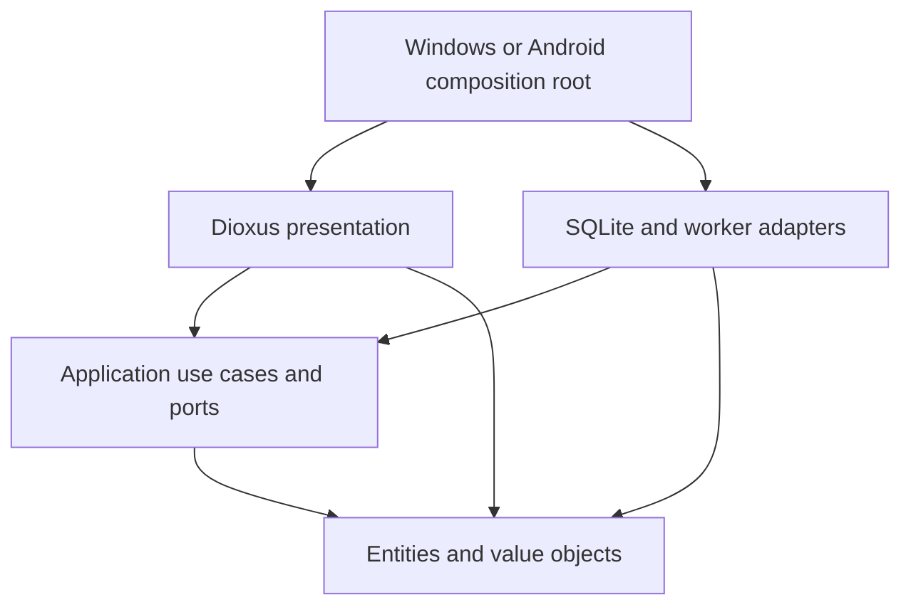

# Architecture — first executable slice

The implemented bounded context is a THB ledger with manual/command entry and reviewed receipt OCR. Tax calculation, device authentication, investment positions, and notification imports remain planned contexts/adapters.

## Dependency direction

Cargo crates enforce the direction. UI receives `UiGateway`; the host wires `LedgerWorker` and a native export dialog. The worker owns one connection and a bounded queue, returning futures. Use cases and repository tests need no window. Domain tests need no database or OS clock.

`apps/android` is a separate test host. Safe Wry JNI dispatch obtains `getNoBackupFilesDir()` and invokes Kotlin Storage Access Framework adapters. SQLite bootstrap, export and receipt recognition run off the UI thread. Kotlin owns document selection, image normalization and untrusted OCR output, never amounts or accounting. A JVM-attached worker polls receipt results with request IDs/cancellation; this avoids repeated UI dispatch across the document picker's Activity transition. The test sandbox includes tanuki assets, Thai fonts and pinned OCR language files. Android INTERNET permission supports Dioxus's authenticated loopback UI transport and explicit LLM model download, not a remote ledger backend.

## Accounting consistency

`Account` and `JournalEntry` are entities with distinct ID types. `AccountName`, `Money`, `PositiveMoney`, `EntryDate`, and `Note` are validated value objects. Account kind and initial categories are closed enums; custom editable categories should become identified catalog entities when implemented.

`ReceiptLine` and `ReceiptBreakdown` are immutable value objects. A breakdown can only be constructed when line contributions equal the payment in exact satang. Editable OCR candidates are application DTOs, not trusted domain objects. The application validates user review and reconciliation before preparing an entry, then generates the durable bullet note from those validated values. The Windows `TesseractOcr` adapter implements the application-owned `ReceiptOcr` port and has no access to the ledger repository. Receipt images/raw OCR remain temporary; the reviewed line details persist in the journal note and CSV.

`JournalEntry` is an aggregate root whose factories create balanced pairs. Positive user-account balances are assets; negative balances are liabilities. System equity/income/expense books are the counterparty. Credit purchases reduce the card balance; bank-to-card payments raise it toward zero. Opening balances affect equity, not earned income.

SQLite mutations acquire an immediate transaction, reload current state, call shared policies, then write every row together. Count, name, and active-account checks happen under the lock. Submission IDs plus payload comparisons distinguish retries from conflicting reuse. Two separately prepared identical purchases remain distinct.

Cancellation reverses the original effective date and preserves the original, reversal relation, and UTC recorded times. Reports omit cancelled originals from income/expense but include all postings in balances. This is correction semantics; refunds need a separate use case.

Account deletion is a separate, permanent operation. `AccountDeletion` is an immutable application review plan containing the exact reviewed ledger state, entry IDs, counts, and counterparty balance previews. It removes the account, opening balance, whole income/expense/transfer aggregates, and associated reversals. A transfer is removed from both accounts; independent entries on its counterparty are retained. Both cancelled and active original transactions are included in the preview count. The plan validates resulting monetary bounds, including balances that previously depended on offsetting transfers.

`SqliteLedger::delete_account` acquires an immediate transaction and compares current state to the reviewed snapshot before deleting any rows. Any intervening ledger mutation requires a fresh review. Postings and journal entries are removed in reverse recording order, then the account; foreign keys stay enabled throughout. Failure rolls back the entire operation. A repeated confirmation is rejected as stale, and cannot affect a newly created account with the same name. The UI defaults focus to keeping the account, displays transfer balance effects, and preserves draft text while clearing references to the deleted account. No schema migration is needed. This is logical deletion from the live ledger, not forensic erasure from SQLite files, OS backups, or previous CSV exports.

## Trust boundaries

`StoredKind` belongs to the persistence adapter. Reading rebuilds domain objects through constructors and verifies saved postings against generated postings. Deserialization does not bypass money/date/note validation.

Chat consumes the entire input: bounded text, exact decimal money, keyword order, quoted names, optional date then note. Recognized shorthand asks for choices. Unknown names remain unresolved and show the real catalog. There is no silent fuzzy correction. The separate model boundary validates required nullable fields, unknown keys, version, cardinality, source substrings, and cross-field constraints. **No local LLM runtime is connected.** A valid proposal never grants write authority.

Prepared entries are previews, not writes. Confirmation sends `Commit`; editing clears the preview. Durable idempotency covers lost responses. UI prevents simultaneous mutations, while the repository independently protects cross-process races.

## Time and projections

`accounting_export` projects actual postings into a general journal, general ledger with running balances, or trial balance. Positive signed postings are debits, negatives credits, including liability accounts. Cancelled originals and their reversals are both exported, with original IDs; the reversal inherits its original income/expense subaccount. Cash-flow dashboard filters must not be reused to omit audit postings. Every journal and report total reconciles in integer satang; i128 activity totals may exceed the bounded per-account `Money`. CSV serialization/localization belongs to application; file dialogs and actual writes stay in the platform host. Thai is the default export language, user-authored names/notes are preserved, UTF-8 BOM and RFC 4180 quoting are retained, and formula-like text is neutralized. These are personal-ledger reports, not a tax classification engine or a complete statutory accounting system.

The host injects a local-date clock; tests inject a fixed date. Relative dates freeze at submission. The current slice supports THB only and rejects future-dated entries. Scheduling is a separate flow. Monthly reports exclude opening balances and transfers from cash-flow totals. A cash-flow difference is not a financial-health score.

Amounts are integer satang bounded by 9,000,000,000,000 satang, including projections. Writes exceeding bounds roll back. Exact money display is separate from floating-point donut geometry. Future multi-currency work needs currency/scale and valuation-date rules.

## Release gates still open

- Database encryption, secure keys, PIN/biometric, encrypted backup/restore and recovery tests are not implemented.
- Full-ledger reads currently validate postings. Add measured pagination/streamed projections, indexing and large-ledger tests before scaling. Never truncate totals silently.
- Future migrations need populated-old-schema and fault fixtures. Foreign/newer databases are refused.
- CSV is user-triggered, contains personal data, and is not a complete backup. PDF/restore are pending.
- Android has a test composition root, private storage, document export and local receipt OCR adapters. Production SDK/signing, full lifecycle/recovery, actual iPhone image variants and real ARM64 device validation remain open; Windows or emulator tests do not prove those capabilities.
- Tax has an explicit status page, with no calculation or complete profile collection. Rule packs and independent legal/fixture review remain required.
- Before selling: remaining product features, accessibility/contrast, lifecycle/real-device tests, dependency/license audit, signed packaging, and privacy/store review.
